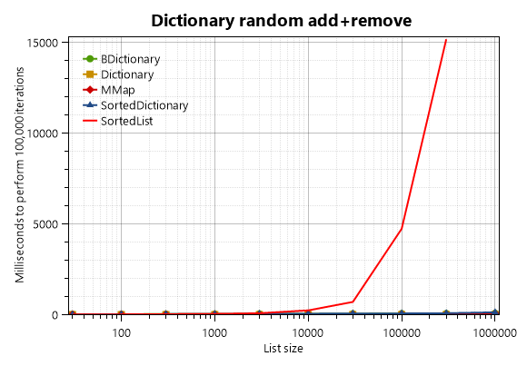

## `SparseAList<T>`

There is one more `AList<T>` data structure that I created after writing the first two articles. The motivation for this data structure was _syntax highlighting_. More on that later.

The `SparseAList<T>` is a list in which not all the indexes are "set". Unset (a.k.a. "clear") indexes are "virtual" and use no memory at all, and `sparseAList[i]` returns `default(T)` when `[i]` is clear. Meanwhile, indexes that _are_ set use 4 bytes extra. The `Count` property returns the total number of "virtual" items, set and unset alike. The internal nodes of `SparseAList<T>` are practically the same as a normal `AList<T>`, but the leaf nodes have a different structure:

~~~csharp
public class SparseAListLeaf<T> : AListNode<int, T>
{
   [DebuggerDisplay("Offset = {Offset}, Item = {Item}")]
   protected struct Entry
   {
      public Entry(uint offset, T item) { Offset = offset; Item = item; }
      public T Item;
      public uint Offset;
   }
   protected InternalDList<Entry> _list;
   protected uint _totalCount;
   ...
~~~

For example, after running this code:

~~~csharp
var list = SparseAList<string>();
list.InsertSpace(0, 1000);
list[321] = "three two one";
list[32] = "three two";
list[3] = "three";
~~~

the list consists of a single leaf node that contains three `Entry` structures:

~~~
_list[0]: Offset = 3, Item = "three"
_list[1]: Offset = 32, Item = "three two"
_list[2]: Offset = 321, Item = "three two one"
_totalCount = 1000
~~~

From the outside it appears to be a list of 1000 items, but in reality there are only three.

This kind of list may resemble a `SortedDictionary<int,T>` but there is a big difference: you can _insert and remove_ ranges of indexes, which efficiently "shifts" the indexes of all items above the affected index. For example, if I add one million real items to a `SparseAList<T>`, I can do `list.InsertSpace(0, 1000)` and this will increase the index of all one million items by 1000 (in O(log N) time).

`SparseAList<T>` implements my `ISparseListSource<T>` and `ISparseList<T>` interfaces. Compared to a normal list, a sparse list offers the following additional methods (or see [Doxygen's rendering](http://loyc.net/doc/code/interfaceLoyc_1_1Collections_1_1ISparseListSource_3_01T_01_4.html)):

~~~csharp
/// 
Represents a read-only indexed list in which parts of the index 
/// space may be unused or "clear".

/// ... long remarks section removed ...
public interface ISparseListSource<T> : IListSource<T>
{
   /// 
Increases <c>index</c> by at least one to reach the next index
   /// that is not classified as empty space, and returns the item at that 
   /// index.

   /// <param name="index">This parameter is increased by at least one, and
   /// perhaps more than one so that it refers to an index where there is a
   /// value. If <c>index</c> is null upon entering this method, the first 
   /// non-empty space in the list is found. If there are no values at higher 
   /// indexes, if the list is empty or if <c>index + 1 >= Count</c>, 
   /// <c>index</c> is <c>null</c> when the method returns.</param>
   /// <remarks>This method must skip over all indexes i for which 
   /// <c>IsSet(i)</c> returns false, and return the next index for which
   /// <c>IsSet(i)</c> returns true. This method must accept any integer as 
   /// input, including invalid indexes.
   /// </remarks>
   T NextHigherItem(ref int? index);

   /// 
Decreases <c>index</c> by at least one to reach the next index
   /// that is not classified as empty space, and returns the item at that 
   /// index.

   /// <param name="index">This parameter is increased by at least one, and
   /// perhaps more than one so that it refers to an index where there is a
   /// value. If <c>index</c> is null upon entering this method, the last
   /// non-empty space in the list is found. If there are no values at lower
   /// indexes, if the list is empty or if <c>index</c> is 0 or less, 
   /// <c>index</c> is <c>null</c> when the method returns.</param>
   /// <remarks>This method must skip over all indexes i for which 
   /// <c>IsSet(i)</c> returns false, and return the next index for which
   /// <c>IsSet(i)</c> returns true. This method must accept any integer as 
   /// input, including invalid indexes.
   /// </remarks>
   T NextLowerItem(ref int? index);

   /// 
Determines whether a value exists at the specified index.

   /// <param name="index"></param>
   /// <returns>true if a value is assigned at the specified index, or false
   /// if index is part of an empty space, or is outside the range of indexes
   /// that exist.</returns>
   bool IsSet(int index);
}

public partial class LCInterfaces
{
   /// 
Gets the next higher index that is not classified as an
   /// empty space, or null if there are no non-blank higher indexes.

   /// <remarks>This extension method works by calling <c>NextHigherItem()</c>.</remarks>
   public static int? NextHigherIndex<T>(this ISparseListSource<T> list, int? index)
   {
      list.NextHigherItem(ref index);
      return index;
   }
   
   /// 
Gets the next lower index that is not classified as an
   /// empty space, or null if there are no non-blank lower indexes.

   /// <remarks>This extension method works by calling <c>NextHigherItem()</c>.</remarks>
   public static int? NextLowerIndex<T>(this ISparseListSource<T> list, int? index)
   {
      list.NextLowerItem(ref index);
      return index;
   }

   /// 
Returns the non-cleared items in the sparse list, along with 
   /// their indexes, sorted by index.

   /// <remarks>
   /// The returned sequence should exactly match the set of indexes for which 
   /// <c>list.IsSet(Key)</c> returns true.</remarks>
   public static IEnumerable<KeyValuePair<int, T>> Items<T>(this ISparseListSource<T> list)
   {
      int? i = null;
      for (;;) {
         T value = list.NextHigherItem(ref i);
         if (i == null) break;
         yield return new KeyValuePair<int, T>(i.Value, value);
      }
   }
}

/// 
Represents a sparse list that allows insertion and removal of items
/// and empty spaces. In a sparse list, some spaces can be "clear" meaning that 
/// they have no value.

/// ... long remarks section removed ...
public interface ISparseList<T> : ISparseListSource<T>, IListAndListSource<T>
{
   /// 
Unsets the range of indices <c>index</c> to <c>index+count-1</c> inclusive.
   /// If <c>index + count > Count</c>, the sparse list shall enlarge <c>Count</c>
   /// to be equal to <c>index + count</c>.

   /// <exception cref="ArgumentOutOfRangeException"><c>index</c> or <c>count</c> was negative.</exception>
   /// <exception cref="OverflowException"><c>index + count</c> overflowed.</exception>
   void ClearSpace(int index, int count = 1);
   
   /// 
Inserts empty space starting at the specified index.

   /// <exception cref="OverflowException"><c>index + count</c> overflowed.</exception>
   /// <exception cref="ArgumentOutOfRangeException"><c>index</c> or <c>count</c
   /// > was negative. If <c>index > Count</c>, this method may throw: if, for 
   /// this kind of list, setting this[i] for some invalid i>=0 throws 
   /// <c>ArgumentOutOfRangeException</c>, then so too does this method throw.
   /// If you want the list to be enlarged instead, call <c>Clear(index, 0)</c> 
   /// first, since the contract of Clear() requires it not to throw in the 
   /// same situation.</exception>
   void InsertSpace(int index, int count = 1);
}
~~~

`SparseAList` supports all the usual features of `AList` such as fast cloning and change notifications ("tree observers" are not currently supported, but I doubt anyone ever uses them.)

## `SparseAList<T>` for syntax highlighting

The first version of my syntax highlighter for [LES](https://github.com/qwertie/LoycCore/wiki/Loyc-Expression-Syntax) simply kept track of the lexer state at the beginning of each line. This basically worked, but there was a challenge or two [I forgot the details because it's been many months since I worked on it], and it didn't allow me to efficiently add "higher-level" syntax highlighting. I wanted to offer syntax highlighting not just of tokens, but also of higher-level elements (using C# as an example, imagine highlighting data types and method names).

The simplest way to do this is to parse the entire file, which is slow. I did not (and don't) know how to achieve incremental parsing, but I felt that I could at least achieve incremental _lexing_, which would speed up the parsing process because lexical analysis tends to account for around half of total parsing time. My idea is that I would build a list of all non-space tokens in the file and the location where each token starts. Then, when the user types stuff, I would re-lex a small region starting before the edit location, in real time, an this would be a very fast operation (most of the time, anyway). The parser would still have to reprocess the entire file, but it would run on a timer, waiting at least one second or so between each parse. This parser would run on a background thread and could operate on a frozen version of the token list in case it changes on the other thread (remember, `AList` supports fast cloning).

Let's say that each token is a quad of (token type, token value, starting location, length). The biggest problem with that is that a file could easily contain 100,000 tokens (e.g. 10,000+ lines of code). If the user edits the beginning of the file, we don't want to update the "start location" associated with 100,000 tokens for every key that the user presses. That's inefficient. A second problem is the relatively large storage space required for such a list.

A commonly-used alternative is to store information per-line rather than holding all information for the entire file in one collection. This allows most updates to affect only a single line, and we don't have to update line numbers or do large data-moving operations unless a newline is added or removed (and even then, the size of "large" operations is proportional to the number of lines rather than the number of characters). Very long lines cause some inefficiency, but those are rare.

But the parser and lexer I had already written were designed to work with indexes, not (line, column) pairs, and it wasn't clear that I could map from one representation to the other quickly enough. Besides, it could be a lot of _non-reusable_ work: work I spent on that would not be useful outside of the specific task of syntax highlighting. I prefer to create software that has _many applications_.

An second alternative is based on an `AList` (or another data structure designed for this scenario, like a [gap buffer](http://en.wikipedia.org/wiki/Gap_buffer)). In this design, a token is not a quad, but rather a triplet of (token type, token value, length), and the starting location of each token is implied by its location in the AList, and there is a special value that means "no token starts at this location". The storage required for this could be reduced using the [flyweight pattern](http://en.wikipedia.org/wiki/Flyweight_pattern), but would probably still require more than 4 times as much memory as the on-disk file size.

To save memory, a variation is to get rid of the token lengths and values, storing only the token type at every character. The token lengths can be obtained on-the-fly when they are needed, and the token values are probably not needed at all for syntax highlighting (the parser could be given dummy values, assuming that the parse results are ultimately discarded). Token types could probably fit in one byte, so that the token information takes the same space as the text or less.

But I didn't think of that solution. Instead I realized that I could create a sparse version of the `AList`, so that the size of the list was proportional to the number of tokens rather than the number of characters (potentially this saves memory, but not necessarily). So that's what I did. In my current syntax highlighter, I use a `SparseAList<EditorToken>` where `EditorToken` is a compact 8-byte version of the usual 16-byte Loyc [Token](http://loyc.net/doc/code/structLoyc_1_1Syntax_1_1Lexing_1_1Token.html), with no `StartIndex`:

~~~csharp
/// 
A compact token representation used by <see cref="SyntaxClassifierForVS"/>.

[DebuggerDisplay("Type = {Type}, Length = {Length}, Value = {Value}")]
public struct EditorToken
{
   public EditorToken(int type, int length, object value)
      { TypeAndLength = (type & 0x3FFF) | (Math.Min(length, 0x3FFFF) << 14); Value = value; }
   public int Type { get { return TypeAndLength & 0x3FFF; } }
   public int Length { get { return (int)((uint)TypeAndLength >> 14); } }
   public Token ToToken(int start) { return new Token(Type, start, Length, NodeStyle.Default, Value); }

   public object Value;
   // 14 bits for token type (enough to handle TokenKind), 18 for length
   int TypeAndLength;
}
~~~

But, this is really a story for another article. Remind me to write one...

## Benchmarks

I finally got around to doing a few simple `AList` benchmarks on a new workstation PC. Fair warning, I only tested `AList` and `BDictionary`, not any of the others like `SparseAList` or `BMultiMap`.

The first test scenario is this:

1. Create a list of a certain size (e.g. 10,000 or 30,000 items)
2. Start the timer
3. Loop 100,000 times: insert or remove 10 items at random locations
   (3b) Every 10 iterations, use `AddRange` or `RemoveRange` to remove or insert 10 items at the end of the list so that the list size stays roughly constant.

First the good news: `AList<T>` has dramatically better performance than `List<T>` for random insertions and deletions when the list size is large:

What's `DList<T>`? It's a direct competitor to the standard `List<T>`, and a simpler alternative to `AList<T>`. I wrote a [separate article about the DList](dlist.html).

The raw timings for a million-item list are

    1000000: Insert at random indexes: AList               |1|    82.0|
    1000000: Insert at random indexes: DList               |1| 18174.0|
    1000000: Insert at random indexes: List                |1| 36190.0|
    1000000: Remove at random indexes: AList               |1|    60.0|
    1000000: Remove at random indexes: DList               |1| 18251.0|
    1000000: Remove at random indexes: List                |1| 35909.0|

So `AList` crushes all. When the list is small, however, `AList<T>` is not the clear winner:
 

In fact, for small lists (under 100 items), `List<T>` is about twice as fast.

`AList` also sucks at simple "filling", where items are always added to the end of the list:

This scenario is to start with a `IList<long>` of a certain size and just add 100,000 more items. `AList<T>` just sucks at that, at least compared to `List<T>` and `DList<T>`, both of which usually complete the task in one millisecond or less.

I also the tested the speed of

1. a loop that reads all elements of the collection repeatedly through the [indexer], i.e.

      for (int c = 0; c < Cycles; c++) {
         sum = 0;
         for (int i = 0; i < list.Count; i++)
            sum += list[i];
      }

2. a loop that scans all elements through `IEnumerator`:

      for (int c = 0; c < Cycles; c++)
         avg = list.Average(); // LINQ scans the collection with `IEnumerator`

Here, `Cycles` is chosen so that `Cycles * list.Count = 10_000_000`.

`AList<T>` is a more complex data structure, so it is traversed more slowly than `List<T>` and `DList<T>`.

Notice that the `IEnumerator` of `AList` has a constant speed while the `[indexer]` of `AList` gets slower for large lists. That's because the indexer requires O(log N) time while `IEnumerator<T>.MoveNext` is an O(1) operation. However, the `AList` enumerator tends to be slower for short lists, maybe because the enumerator needs more time to initialize (except for very short lists that contain only a leaf node, the enumerator allocates a small array--a traversal stack--when enumeration starts.)

I noticed something interesting about `List<T>`: access by `IEnumerator<T>` is up to 7 times slower than direct access by the indexer! For example, in the list with 100000 items, the `List<T>` indexer benchmark takes 14 ms, but the `List<T> IEnumerator` benchmark takes 92 ms. Why is this? I suspect it's because when you use LINQ (access through `IEnumerator<T>`), the traversal cannot be inlined by the JIT. If inlining occurs, it's naturally much faster because adding up a bunch of numbers is a very, very simple job for a computer. Also, if inlining occurs, it's possible that one of the two range checks required by List<T> can be eliminated (yeah, there are two. One is a range check against the `Count` of `List<T>`, the other is a check against the `Length` of the array inside the `List<T>`.)

I noticed that `DList<T>` wasn't getting as much of a performance boost through the indexer so I tried `InternalDList<T>` instead, which gets better results (see my [DList article](dlist.html).)

### Dictionary benchmarks

I did a single simple benchmark for five kinds of `<long, int>` dictionaries (`Dictionary`, `MMap`, `BDictionary`, `SortedDictionary` and `SortedList`). The test setup was:

1. Create a dictionary with a sequence of integers starting at zero, where each new integer equals the last integer plus a random number between 50 and 150. Record the largest integer.
2. Start timer.
3. 100,000 times, pick an integer at random between 0 and the largest integer. Insert this integer into the list, and then (if the list size increased) remove it again.
4. Measure time.

The results are clear:

Clearly, `SortedList` is evil! Specifically, for any collection of about 300 items or more, `SortedList` is the slowest kind of dictionary, and if there are 10000 items or more, it starts to get ridiculously slow. If a `SortedList` contains 3 million items, 100,000 random insertions take 401 seconds (nearly 7 minutes) on this high-end PC; that's over 4 milliseconds for every iteration.

Now let's see a graph without `SortedList` screwing up the Y axis:

.png)

It should be noted that sorted dictionaries is normally slower than unsorted dictionaries. The standard `Dictionary<K,V>` and the `MMap<K,V>` class of [Loyc.Collections](/collections) are both unsorted, so they are faster than `BDictionary<K,V>` and the standard `SortedDictionary<K,V>` which are sorted.

To my disappointment, `BDictionary<K,V>` is usually slower than `SortedDictionary<K,V>`. On the plus side, `BDictionary<K,V>` uses less memory than `SortedDictionary<K,V>` because it packs its items into arrays. In contrast, `SortedDictionary` is a red-black tree that allocates a separate heap object for every pair (node) in the dictionary. The overhead of this is 5 words per item, typically 40 bytes in a 64-bit process (that's two words for the object header, two words for references to the left and right children of each node, and one word for the "red" flag of the [red-black tree](http://en.wikipedia.org/wiki/Red%E2%80%93black_tree)). It should also be noted that `SortedDictionary<K,V>` can cause more stress on the garbage collector than `BDictionary<K,V>` because it contains so many references; I expect this only affects performance significantly in apps with large heaps.

Although its speed is merely O.K., `BDictionary<K,V>` is often a better choice than `SortedDictionary<K,V>` because it supports many operations, such as "find next higher key", "split list into two pieces", "observe changes" and "clone instantly" that `SortedDictionary<K,V>` does not.

## Download!

I am happy to announce a new NuGet package called "LoycCore" which includes all the variants of `AList` as well as other data structures (including `DList`) and various other handy stuff, including most of the stuff I have published articles about in the past. I also created a [new web site for Loyc Core](http://core.loyc.net).
