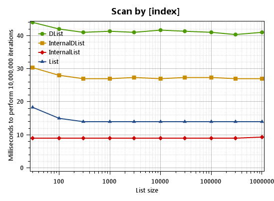
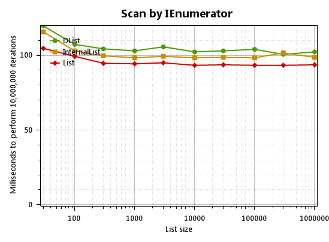
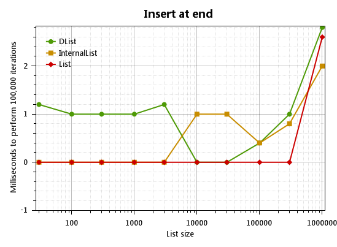
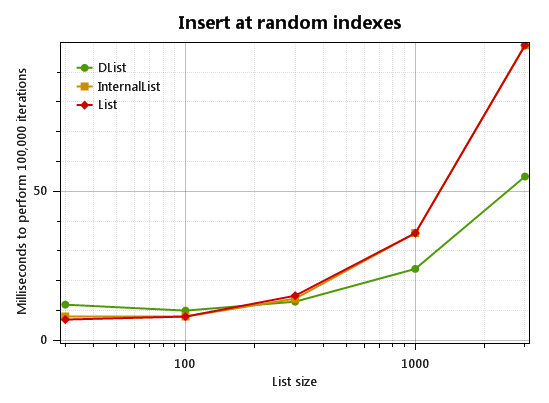
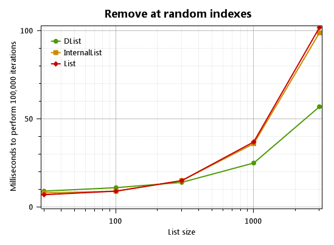

## Introduction

For some of us who write low-level code that is intended to be compact and fast, the standard `List<T>` can seem like overkill. It requires two separate heap objects, and must perform extra checks that a plain array does not. For that reason, if you're writing code that you want to be as fast as possible, you might consider using a `T[]` array instead of `List<T>`.

### The downside to `List<T>`

From a performance perspective, there are two things that make a `List<T>` "worse" than a plain array: size, and speed.

#### Size

A `List<T>` requires at least two heap allocations: one for the `List<T>` object itself, and another for the array backing the `List<T>`. Each .NET object has a two-word header, and `List<T>` has four fields:

~~~csharp
private T[] _items;
private int _size;
private object _syncRoot; // not used unless you call SyncRoot
private int _version;
~~~

So `List<T>` requires six additional words of memory compared to an array (I mean "machine words" in the traditional sense, meaning an IntPtr-sized memory area, so the total is 24 extra bytes in a 32-bit process and probably 40 bytes in 64-bit, assuming the CLR fits `_size` and `_version` into a single word.)

#### Speed

`List<T>` must also perform extra range checks. For example, the indexer looks like this:

~~~csharp
public T this[int index]
{
    get {
        if ((uint)index >= (uint)_size)
            ThrowHelper.ThrowArgumentOutOfRangeException();
        return _items[index];
    }
    set {
        if ((uint)index >= (uint)_size)
            ThrowHelper.ThrowArgumentOutOfRangeException();
        _items[index] = value;
        _version++;
    }
}
~~~

Note that the `_items[index]` operation implicitly contains a range check: the CLR performs a check equivalent to `(uint)index < (uint)_items.Length` before it actually reads from an array or writes to it. So there are actually two range checks here. The JIT usually does not know that `_size < _items.Length` so it cannot remove the second check based on the result of the first check.

### The downside to `T[]`

Unfortunately, if you use a plain array instead, you can't simply "add" or "remove" items, since an array has a single fixed size. Consequently if you decide that you really want a plain array but you need to add, remove, or (heaven forbid!) insert items, you'll end up pretty much reimplementing `List<T>` by yourself. You'll have an array variable and a count variable...

~~~csharp
private T[] _array;
private int _count;
~~~

and then you might write a bunch of code to do the things that `List<T>` already does, like insertions:

~~~csharp
static T[] Insert<T>(int index, T item, T[] array, ref int count)
{
    Debug.Assert((uint)index <= (uint)count);
    if (count == array.Length) {
        int newCap = array.Length * 2;
        array = CopyToNewArray(array, count, newCap);
    }
    for (int i = count; i > index; i--)
        array[i] = array[i - 1];
    array[index] = item;
    count++;
    return array;
}
static T[] CopyToNewArray<T>(T[] _array, int _count, int newCapacity)
{
    T[] a = new T[newCapacity];
    Array.Copy(_array, a, _count);
}
~~~

Of course, this road leads to madness. Luckily, you never need to write code like this: just use `InternalList<T>` instead!

## Introducing InternalList

`InternalList<T>` is a drop-in substitute for `List<T>` defined like this:

~~~csharp
[Serializable]
public struct InternalList<T> : IListAndListSource<T>, 
              IListRangeMethods<T>, ICloneable<InternalList<T>>
{
    public static readonly T[] EmptyArray = new T[0];
    public static readonly InternalList<T> Empty = new InternalList<T>(0);

    private T[] _array;
    private int _count;

    public InternalList(int capacity) {...}
    public InternalList(T[] array, int count) { _array=array; _count=count; }
    public InternalList(IEnumerable<T> items) : this(items.GetEnumerator()) {}
    public InternalList(IEnumerator<T> items) {}

    public int Count {...}
    public int Capacity {...}
    public void Resize(int newSize, bool allowReduceCapacity = true) {...}
    public void Add(T item) {...}
    ...
    ...
}
~~~

To eliminate the extra memory required by `List<T>`, InternalList is a `struct` rather a `class`; and for maximum performance, it asserts rather than throwing an exception when an incorrect array index is used, so that Release builds (where `Debug.Assert` disappears) run as fast as possible.

`InternalList` also has an `InternalArray` property that provides access to the internal array. This actually allows you to work around certain pesky problems with the ordinary `List<T>`. For example, an ordinary List<T> doesn't allow you to do this:

    List<Point> pts;
    ...
    // error CS1612: Cannot modify the return value of 'List<Point>.this[int]' because it is not a variable
    pts[0].X = 5;

But if `pts` is an `InternalList` then you can write `pts.InternalArray[0].X = 5;`.

`InternalList<T>` has other things that `List<T>` doesn't, such as a `Resize()` method (and an equivalent setter for `Count`), and a handy `Last` property to get or set the last item.

But it should be understood that `InternalList` is only meant for rare cases where you need better performance than `List<T>`. It does have major disadvantages:

1. You must not write `new InternalList<T>()` because C# does not support `struct` default constructors and `InternalList<T>` requires non-null initialization; methods such as `Add()`, `Insert()` and `Resize()` assume `_array` is not null. The correct initialization is `InternalList<T> list = InternalList<T>.Empty;`

2. Passing this structure by value is dangerous because changes to a copy of the structure may or may not be reflected in the original list. In particular the `_count` of the original list won't change but the contents of `_array` _may_ change. It's best not to pass it around at all, but if you must pass it, pass it by reference. This also implies that an `InternalList<T>` should not be exposed by any `public` API, and storing `InternalList<T>` inside another collection (e.g. `Dictionary<object, InternalList<T>>` can be done but must be done carefully to avoid code that _compiles_ but doesn't work as intended.

Again, the fundamental problem is that when you pass `InternalList` by value, a copy of the `_count` and `_array` variables is made. Changes to those variables do not affect the other copies, but changes to the _elements_ of `_array` _do_ affect other copies (incidentally, this is similar to the mutation behavior of [slices in D](http://dlang.org/d-array-article.html)). If you want to return an internal list from a public API you can cast it to `IList<T>` or `IReadOnlyList<T>`, but be aware that future changes made to the `InternalList` by your code may not be seen properly by clients using the `IList<T>`, and vice versa.

Finally, alongside `InternalList<T>`, there is a `static class InternalList` that has some static methods (`CopyToNewArray`, `Insert`, `RemoveAt`, `Move` to help manage raw arrays. Most methods of `InternalList<T>` simply call methods of `InternalList`.

## Benchmarks

The main purpose of `InternalList<T>` is to save memory, but occasionally you'll notice a speed difference. 

I temporarily tweaked my list benchmarks from the [List Trifecta](http://core.loyc.net/collections/alists-part1.html) series. Generally `InternalList<T>` performs identically to `List<T>` except that this linear scan for-loop can read the list 55% faster (i.e. 34% less time).

~~~csharp
long sum = 0;
for (int c = 0; c < Cycles; c++) {
	sum = 0;
	for (int i = 0; i < list.Count; i++)
		sum += list[i];
}
~~~

The `IEnumerator` is (of course) not faster but not notably slower. However, notice that scanning via `IEnumerator` takes a full 10 times as much time as a plain `for` loop (a `foreach` loop on `InternalList<T> L` may be much faster than a `foreach` loop on `(IEnumerable<T>)L`, but I didn't benchmark that, sorry. I'm kinda busy.)

~~~csharp
double avg = 0;
for (int c = 0; c < Cycles; c++)
	avg = list.Average(); // uses IEnumerator<long>
~~~

"Filling" is slightly slower if you don't set `Capacity` in advance because `InternalList<T>` enlarges itself 23.9% more often in order to save a little memory. Note: the graph is almost meaningless because the timer resolution is too poor and because the most expensive part of `Add` is enlarging the internal array; `List` and `InternalList` do this at different sizes and there aren't enough data points to definitively see what is going on.

The other results are pretty much the same as `List<T>`.

## Download

`InternalList<T>` is part of `Loyc.Essentials.dll`, which is part of the "LoycCore" NuGet package.

You can see the original source code [here](https://github.com/qwertie/LoycCore/blob/master/Loyc.Essentials/Collections/Implementations/InternalList.cs) but it cannot be copied directly into another project since it references a couple of external things in Loyc.Essentials.dll. Therefore, I made this [standalone version](https://gist.github.com/qwertie/7e1461f01b68defbe4bf). Enjoy!
