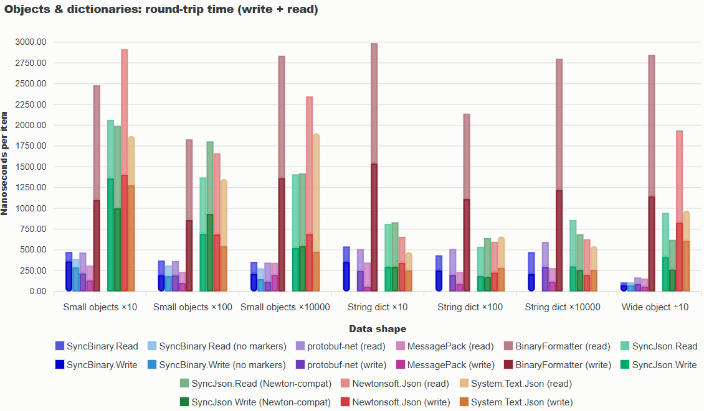
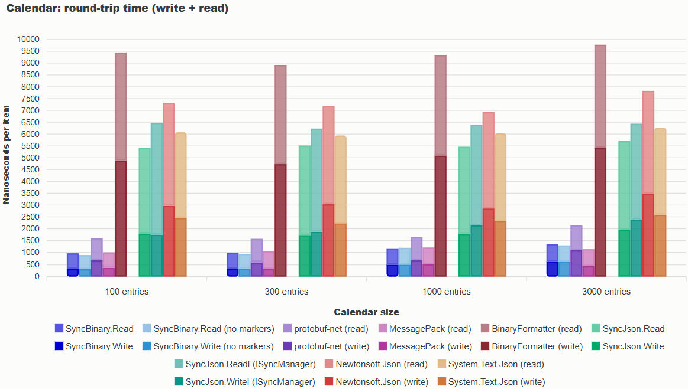
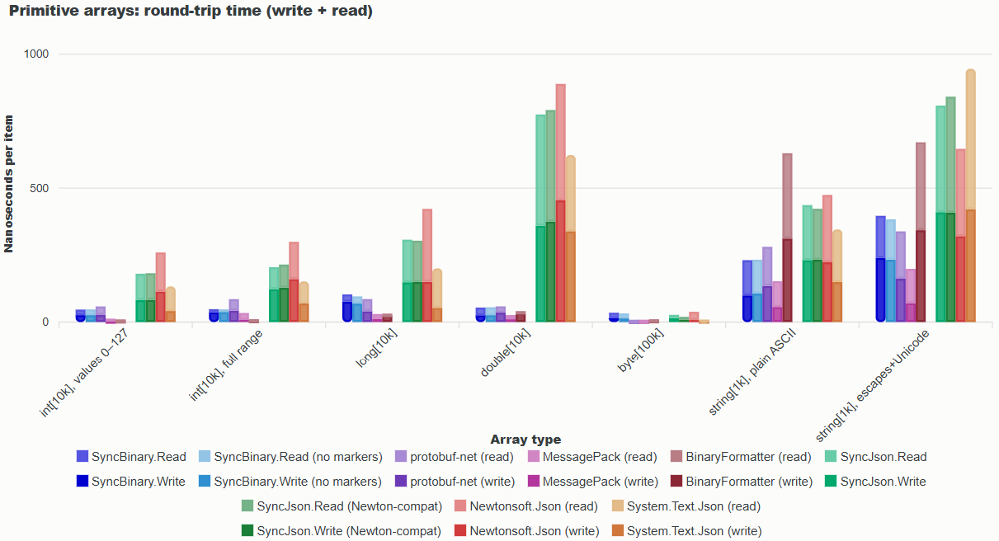

SyncLib is a .NET system for projects where traditional attribute-based serialization falls flat, forcing you to use DTOs. Use it when you want to save or transmit data with

- Type conversions (below: Color <=> string, and BMultiMap <=> List)
- Nonlocal representation changes (Start + End Date <=> Start Date + Duration)
- Backward compatibility
- Serializing the same type in multiple ways depending on context
- Multiple technologies without changing your serializers (JSON, binary, protocol buffers)

SyncLib does it all in half as many lines of code as DTO-based solutions (SyncLib version at left)

SyncLib &mdash; 83 lines


public class CalendarSync
{
  // Note: The serialized form does not include the Calendar.Id but it's included
  //       in the Web API's URL. The web controller will save that Calendar Id here.
  public int CalendarId { get; set; }
  public int ApiVersion { get; set; } = 2;

  public SyncJson.Options Options = new SyncJson.Options { NameConverter = SyncJson.ToCamelCase };

  public string Serialize(Calendar calendar) => SyncJson.WriteStringI(calendar, Sync, Options);
  public Calendar? Deserialize(string json) => SyncJson.ReadI<Calendar>(json, Sync, Options);

  public Calendar Sync(ISyncManager sm, Calendar? calendar)
  {
    _calendar = calendar ??= new Calendar { Id = CalendarId };

    if (ApiVersion >= 2)
      calendar.DefaultColor = sm.Sync("DefColor", calendar.DefaultColor, new SyncColor<ISyncManager>());

    // Serialize (save) or deserialize (load). It's saved as a simple list of
    // entries, while in memory we have a more complex dictionary data structure.
    IReadOnlyCollection<CalendarEntry> entries = calendar.Entries.Select(p => p.Value);
    var entriesOut = sm.SyncColl("Entries", entries, SyncEntry, ObjectMode.Normal)!;
    if (sm.IsReading) {
      calendar.Entries.Clear();
      foreach (var entry in entriesOut)
        calendar.Entries.Add(entry.StartTime, entry);
    }

    calendar.UserId = sm.Sync("UserId", calendar.UserId);

    return calendar;
  }

  private Calendar? _calendar;

  private CalendarEntry SyncEntry(ISyncManager sm, CalendarEntry? entry)
  {
    entry ??= new CalendarEntry { Id = CalendarId };

    if (ApiVersion >= 2) {
      entry.Duration = sm.SyncTimeAsString("Duration", entry.Duration);
      entry.Color    = sm.Sync("Color", entry.Color, new SyncColor<ISyncManager>());
    }

    entry.Calendar  ??= _calendar;
    entry.CalendarId  = entry.Calendar!.Id;
    entry.Id          = sm.Sync("Id", entry.Id);
    entry.Description = sm.Sync("Description", entry.Description) ?? "";
    entry.StartTime   = sm.SyncDateAsString("StartTime", entry.StartTime);
    entry.Location    = sm.Sync("Location", entry.Location) ?? "";
    entry.AdvanceReminder = sm.SyncTimeAsString("AdvanceReminder", entry.AdvanceReminder);

    if (ApiVersion <= 1) {
      // API version 1 has an EndTime field instead of a Duration field
      var end = sm.SyncDateAsString("EndTime", entry.StartTime.Add(entry.Duration));
      if (sm.IsReading)
        entry.Duration = end.Subtract(entry.StartTime);
    }

    return entry;
  }
}

// A custom synchronizer for Color values (it saves them in hex, e.g. "#446688")
public struct SyncColor<SM> : ISyncField<SM, Color> where SM : ISyncManager
{
  public Color Sync(ref SM sm, FieldId name, Color color)
  {
    var str = sm.Sync(name, ToString(color));
    if (str == null)
      throw new FormatException("Got null when a color was expected");
    return ToColor(str);
  }

  public static string ToString(Color c) => "#" + (c.ToArgb() & 0xFFFFF).ToString("X6");
  public static Color ToColor(string? s)
  {
    if (s == null || !s.StartsWith("#"))
      throw new FormatException("Expected a color (starting with '#')");
    return Color.FromArgb(Convert.ToInt32(s.Substring(1), 16));
  }
}


Traditional (Newtonsoft.Json DTOs) &mdash; 166 lines


public class JsonCalendar
{
  public IEnumerable<JsonCalendarEntry?>? Entries { get; set; }
  public int UserId { get; set; }
}

public class JsonCalendarV2 : JsonCalendar
{
  public string? DefColor { get; set; }
  public new IEnumerable<JsonCalendarEntryV2?>? Entries { get; set; }
}

public class JsonCalendarEntry
{
  public int Id { get; set; }
  public string? Description { get; set; }
  public DateTime StartTime { get; set; }
  public string? Location { get; set; }
  public TimeSpan? AdvanceReminder { get; set; }
  public virtual DateTime EndTime { get; set; }
}

public class JsonCalendarEntryV2 : JsonCalendarEntry
{
  [JsonIgnore]
  public override DateTime EndTime { get; set; }
  public TimeSpan Duration { get; set; }
  public string? Color { get; set; }
}

public class JsonCalendarSerialization
{
  // Note: The serialized form does not include the Calendar.Id but it's included
  //       in the Web API's URL. The web controller will save that Calendar Id here.
  public int CalendarId { get; set; }
  public int ApiVersion { get; set; } = 2;

  private JsonSerializer _serializer = new JsonSerializer {
    Formatting = Formatting.Indented,
    PreserveReferencesHandling = PreserveReferencesHandling.None,
    ContractResolver = new DefaultContractResolver()
    {
      NamingStrategy = new CamelCaseNamingStrategy()
    }
  };

  public string Serialize(Calendar calendar)
  {
    var sb = new StringBuilder();
    using (var writer = new StringWriter(sb))
      _serializer.Serialize(writer, ToJsonCalendar(calendar));

    return sb.ToString();
  }

  public Calendar? Deserialize(string json)
  {
    var expectedType = ApiVersion >= 2 ? typeof(JsonCalendarV2) : typeof(JsonCalendar);
    var calendar = _serializer.Deserialize(new StringReader(json), expectedType);

    return calendar == null ? null : FromJsonCalendar((JsonCalendar) calendar);
  }

  #region Code to convert Calendar to JsonCalendar for serialization

  public JsonCalendar ToJsonCalendar(Calendar calendar)
  {
    var jsonEntries = calendar.Entries.Select(pair => ToJsonCalendarEntry(pair.Value));

    if (ApiVersion <= 1) {
      return new JsonCalendar {
        UserId = calendar.UserId,
        Entries = jsonEntries,
      };
    } else {
      return new JsonCalendarV2 {
        UserId = calendar.UserId,
        Entries = jsonEntries.Cast<JsonCalendarEntryV2>(),
        DefColor = ToString(calendar.DefaultColor),
      };
    }
  }

  private JsonCalendarEntry ToJsonCalendarEntry(CalendarEntry entry)
  {
    JsonCalendarEntry jsonEntry;
    if (ApiVersion <= 1) {
      jsonEntry = new JsonCalendarEntry() {
        EndTime = entry.StartTime.Add(entry.Duration)
      };
    } else {
      jsonEntry = new JsonCalendarEntryV2 {
        Duration = entry.Duration,
        Color = ToString(entry.Color)
      };
    }

    jsonEntry.Id = entry.Id;
    jsonEntry.Description = entry.Description;
    jsonEntry.StartTime = entry.StartTime;
    jsonEntry.Location = entry.Location;
    jsonEntry.AdvanceReminder = entry.AdvanceReminder;

    return jsonEntry;
  }

  #endregion

  #region Code to convert JsonCalendar to Calendar after deserialization

  private Calendar FromJsonCalendar(JsonCalendar jsonCalendar)
  {
    _calendar = new Calendar() {
      Id = this.CalendarId,
      UserId = jsonCalendar.UserId,
      Entries = new BMultiMap<DateTime, CalendarEntry>()
    };

    var entries = jsonCalendar.Entries ?? (jsonCalendar as JsonCalendarV2)?.Entries;
    if (entries == null)
      throw new FormatException("Missing calendar entries");

    foreach (var entry in entries)
      _calendar.Entries[entry!.StartTime].Add(FromJsonCalendarEntry(entry!));

    if (jsonCalendar is JsonCalendarV2 v2) {
      _calendar.DefaultColor = ToColor(v2.DefColor);
    }

    return _calendar;
  }

  private Calendar? _calendar;

  private CalendarEntry FromJsonCalendarEntry(JsonCalendarEntry jsonEntry)
  {
    var entry = new CalendarEntry();

    entry.Calendar = _calendar;
    entry.CalendarId = _calendar!.Id;
    entry.Id = jsonEntry.Id;
    entry.Description = jsonEntry.Description ?? "";
    entry.StartTime = jsonEntry.StartTime;
    entry.Location = jsonEntry.Location ?? "";
    entry.AdvanceReminder = jsonEntry.AdvanceReminder;

    if (jsonEntry is JsonCalendarEntryV2 v2) {
      entry.Color = ToColor(v2.Color);
      entry.Duration = v2.Duration;
    } else {
      entry.Duration = jsonEntry.EndTime.Subtract(jsonEntry.StartTime);
    }

    return entry;
  }

  #endregion

  public static string ToString(Color c) => "#" + (c.ToArgb() & 0xFFFFF).ToString("X6");
  public static Color ToColor(string? s)
  {
    if (s == null || !s.StartsWith("#"))
      throw new FormatException("Expected a color (starting with '#')");
    return Color.FromArgb(Convert.ToInt32(s.Substring(1), 16));
  }
}


Shared business classes (`Calendar` and `CalendarEntry`) are the same for both and not shown. See the full runnable example in [HomePageCalendarExample.cs](https://github.com/qwertie/ecsharp/blob/master/Core/Tests/SyncLib/HomePageCalendarExample.cs).

## And it's fast!

Within each group of bars, binary serializers are on the left and plain-text serializers are on the right. SyncLib serializers are blue/green.

For more, read the [SyncLib manual](./manual).
